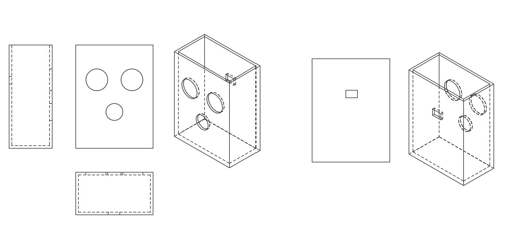
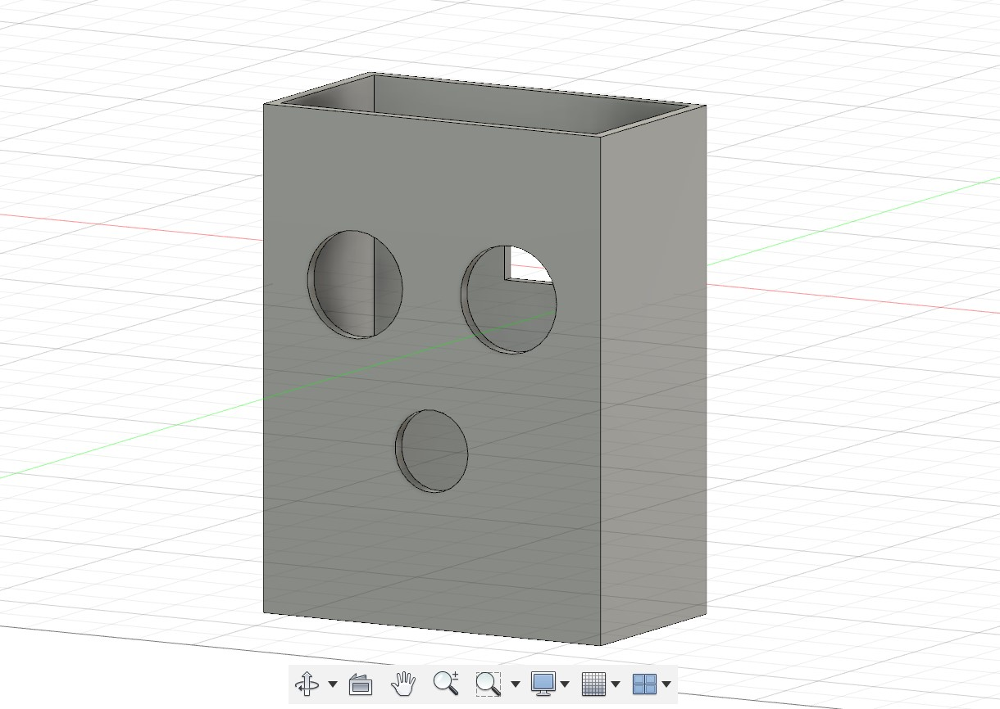
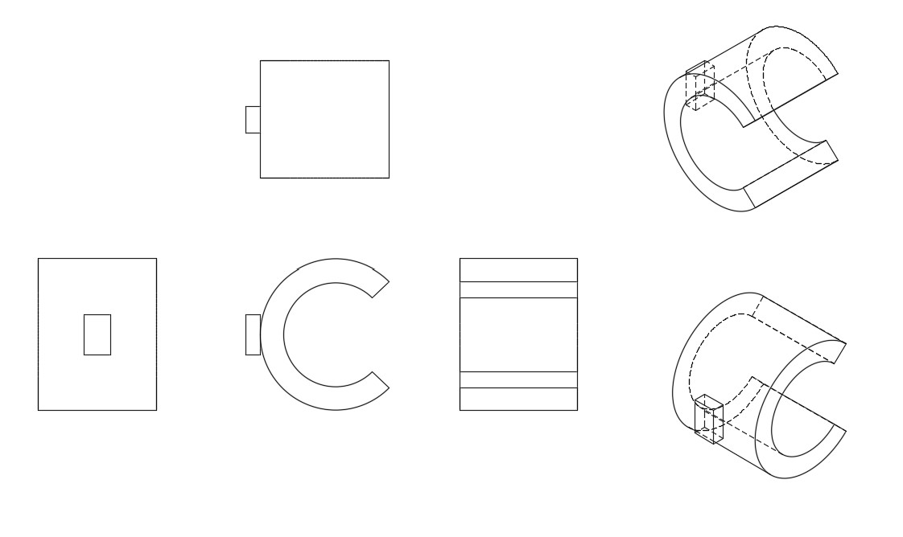
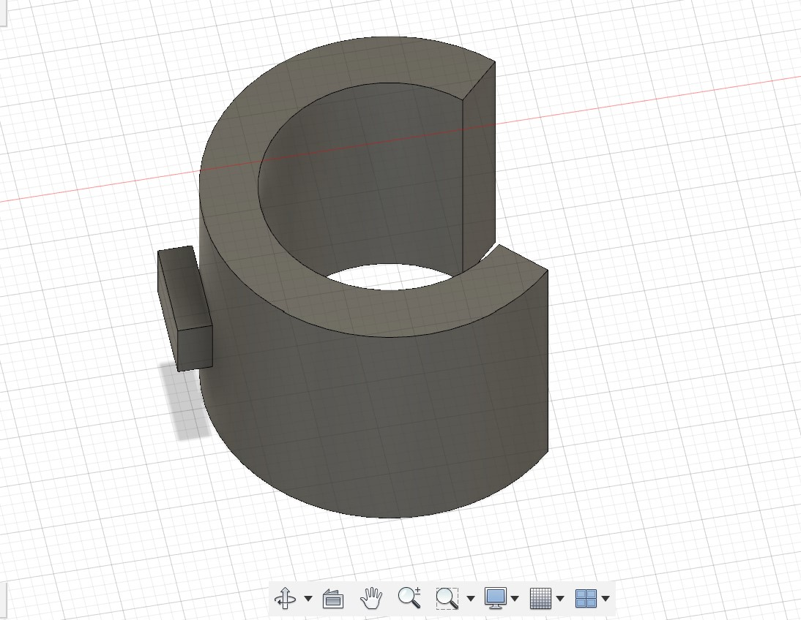
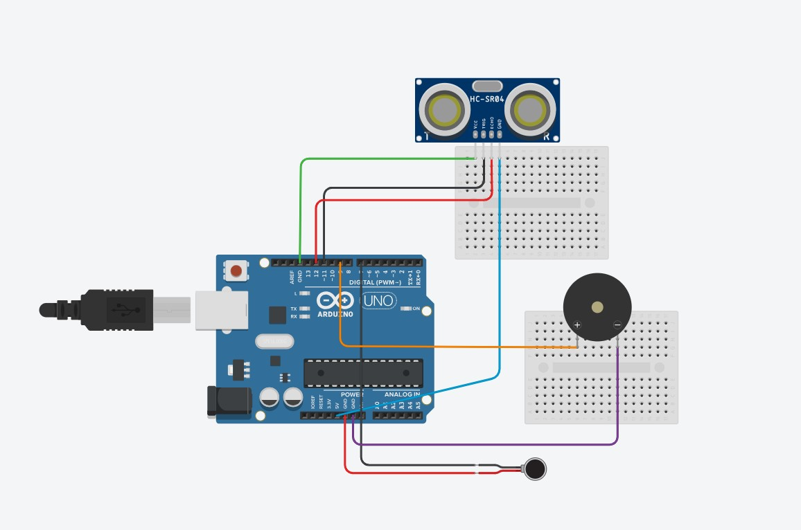

# Smart Walking Stick
This project is a smart walking stick to aid the visually impaired, using Arduino. It can assist them with walking alone in new environments by giving live signals if the person is close to an obstacle. This is done by taking inputs through an obstacle sensor (in this case an ultrasonic sensor) and providing feedback to the person through haptics (here a vibration motor is used). 


| **Engineer** | **School** | **Area of Interest** | **Grade** |
|:--:|:--:|:--:|:--:|
| Dia I | Bret Harte Middle School | Mechanical Engineering | Rising 8th Grader

<!---**Replace the BlueStamp logo below with an image of yourself and your completed project. Follow the guide [here](https://tomcam.github.io/least-github-pages/adding-images-github-pages-site.html) if you need help.**-->


  

#Final Milestone

**Don't forget to replace the text below with the embedding for your milestone video. Go to Youtube, click Share -> Embed, and copy and paste the code to replace what's below.** 

<iframe width="560" height="315" src="https://www.youtube.com/embed/F7M7imOVGug" title="YouTube video player" frameborder="0" allow="accelerometer; autoplay; clipboard-write; encrypted-media; gyroscope; picture-in-picture; web-share" allowfullscreen></iframe>

## DESCRIPTION
My final milestone for the smart-walking stick project is designing and 3D-printing a box to hold my Adruino circuit board, and attatch it to my walking stick. I used Fusion 360 to CAD this piece. The box needed to include multiple factors: being big enough to hold my components, and allowing the ultrasonic sensor to have a clear view. I also decided that I want the buzzer to be positioned outside, so as to provide a clear sound. Additionally, I want this box to be removable from walking stick, which led me to adding a clip. So I came up with my final design: a box 80 mm in height, 60 mm in length, and 33 mm in width. The top is open so that the circuits can be easily removied. On the box are 3 circlular openings: 2 for the ultrasonic sensor, and one for the buzzer. I added a clip that revolves 270 degrees, so that it can be attactched onto the walking stick.
             







                            
## CHALLENGES
I faced multiple challenges when I was designing my box. At the beginning, I didn't understand many of the toos and shortcuts on Fusion 360, which led me to designing some parts of my box in an incorrect way. Additionally, my original design of my had the clip and box already attached to one another. However, I found out that this design would be difficult to 3D-print, and had a possibilty of by box collapsing. So, I had to seperate the clip and box, and add a small tab to the clip that I could insert and attatch to the box after they were 3D-printed in two seperate pieces. 


For your final milestone, explain the outcome of your project. Key details to include are:
- What you've accomplished since your previous milestone
- What your biggest challenges and triumphs were at BSE
- A summary of key topics you learned about
- What you hope to learn in the future after everything you've learned at BSE -->

# Second Milestone

<!---**Don't forget to replace the text below with the embedding for your milestone video. Go to Youtube, click Share -> Embed, and copy and paste the code to replace what's below.** 

<iframe width="560" height="315" src="https://www.youtube.com/embed/F7M7imOVGug" title="YouTube video player" frameborder="0" allow="accelerometer; autoplay; clipboard-write; encrypted-media; gyroscope; picture-in-picture; web-share" allowfullscreen></iframe>-->

## DESCRIPTION
My second milestone was adding some modifcations onto the base product of my project. I decided to add 2 modifcations: an on-off switch for the user to be abe to turn the buzzer sound/ vibration motor on and off. Also, I adjusted my program to have the buzzer beep at different frequencies, depending on how far away the ultrasonic sensor detects an object. FOr my on-off switch, I had to connect the two outer pins to ground and 5V, and the middle to any digital pin. The way this works is when the switch is toggles to the "on" side (which is connected to the 5V), the electric signal flows and is picked up by the digital pin. In my program I used a conditional, so when the digital pin reads high electric signals, the ultrasonic sensor, buzzer, and vibration motor carry out their functions. However, when electricty is grounded, the sesnor stops emmiting and recieving signals. Therefore, when the switch is toggled on, the circuit gives warnings when an object is close, but when the switch is off, the warnings stop. My second modification was changing the rate of the buzzer. When the ultrasonic sensor reads an object a distance between 10 and 20 cm, a slow rate of beeping begins, but as soon as the object is less than 10 cm away, the buzzing rate ebecomes faster, slerting the user to a close object.

## CHALLENGES
One challenge I faced was that I ran out of ground and 5V pins, because I had alreay connected the ones on the Arduino board itself. However, I still needed to connect my on-off switch to a ground and 5V pin. I solved this by using a breadboard and connecting the pins I needed to te power rails, which made the whole rail connected to the pins I needed. Another struggle  I had was correctly nesting the ultrasonic sensor conditional inside of the on-off switch conditional in program. 

## NEXT STEPS
My next steps will be figuring out how to mount my circuit board onto the walking stick itself.


# First Milestone

<!---**Don't forget to replace the text below with the embedding for your milestone video. Go to Youtube, click Share -> Embed, and copy and paste the code to replace what's below.**-->

<iframe width="560" height="315" src="https://www.youtube.com/embed/LAWkWSDc7j0?si=nBxFlckE_LIzSlkL" title="YouTube video player" frameborder="0" allow="accelerometer; autoplay; clipboard-write; encrypted-media; gyroscope; picture-in-picture; web-share" referrerpolicy="strict-origin-when-cross-origin" allowfullscreen></iframe>

## DESCRIPTION:
For my first milestone, I put together the circuit board needed for my intensive project, and got some simple distance measurement readings from the ultraonic sensor. Then, using these readings I was able to write a program to start a vibration motor and piezzo buzzer when the ultrasonic sensor detected comething a certain distance away. I used a threshold value of 25 cm for the sensor. In my program, the ultrasonic sensor's trig pin emmits a high frequency sound wave, which bounces off an object and is recieved by the echo pin. The duration that it took for this sound wave to bounce back is measured, and used to calculate the distance of the object.  Using a threshold of 25 cm means that as soon as  the ultrasonic sensor detects that an object or obstacle is a distance of 25 cm away or closer, the vibration motor wil vibrate instensly and the buzzer will emmit a beeping sound. This serves as a warning that an object or obstacle is near. Components I used were:

    - An Arduino UNO: runs the program and contains the pins which connect my components
    - Ultrasonic sensor: this measures distances/how far away objects are
    - Vibration motor: vibrates when object is detected
    - Buzzer: Makes a long beeping noise when object is detected
    - Breadboards: these allowed me to indirectly connect components to the Arduino, without soldering
    - Jumper wires: connects the circuit

## CHALLENGES:
I faced some challeges along the way to my first milestone. This included some incorrect wiring, and defining components to the wrong pins in my Arduino IDE program. It therefore resulted in my code not working at first. Additionally, at the beginning I didn't understand how to write some statements in the program, but I was able to learn by watching some tutorials.

## NEXT STEPS:
My next steps will be adding modifications to my project, such as potentially adding an on-off switch for the user to manually turn off the buzzer and vibration motor's warnings.

<!--- For your second milestone, explain what you've worked on since your previous milestone. You can highlight:
- Technical details of what you've accomplished and how they contribute to the final goal
- What has been surprising about the project so far
- Previous challenges you faced that you overcame
- What needs to be completed before your final milestone -->

# Starter Milestone

<!---**Don't forget to replace the text below with the embedding for your milestone video. Go to Youtube, click Share -> Embed, and copy and paste the code to replace what's below.**

<iframe width="560" height="315" src="https://www.youtube.com/embed/NS1_Kgo3bcE?si=AC-kKYHpRvg2FyuU" title="YouTube video player" frameborder="0" allow="accelerometer; autoplay; clipboard-write; encrypted-media; gyroscope; picture-in-picture; web-share" referrerpolicy="strict-origin-when-cross-origin" allowfullscreen></iframe>-->


## DESCRIPTION:
My starter project was a device called the RGB Slider, where I could control the color of an LED light with 3 sliders, as shown above. Each slider manipulates the intentsity of the 3 primary colors in the LED light: red, green, and blue. By adjusting different amounts of power that goes to each LED light color, a wide range of colors were produced. My power source came from my computer. 

## CHALLENGES: 
A challenge I faced was soldering the components onto the board. I was fairly new to soldering at the time, so I made some mistakes, such as soldering too less, or joining two parts that weren't ment to be together. To fix this, I had to de-solder, which was a pretty challenging process. However, this project really helped me get comfortable with soldering. 

## NEXT STEPS: 
Since the starter project is complete the next step is to start on my intensive project.

# Schematics 

<!--Here's where you'll put images of your schematics. [Tinkercad](https://www.tinkercad.com/blog/official-guide-to-tinkercad-circuits) and [Fritzing](https://fritzing.org/learning/) are both great resoruces to create professional schematic diagrams, though BSE recommends Tinkercad becuase it can be done easily and for free in the browser. -->



<!---# Code
Here's where you'll put your code. The syntax below places it into a block of code. Follow the guide [here]([url](https://www.markdownguide.org/extended-syntax/)) to learn how to customize it to your project needs. 

```c++
void setup() {
  // put your setup code here, to run once:
  Serial.begin(9600);
  Serial.println("Hello World!");
}

void loop() {
  // put your main code here, to run repeatedly:

}
```
-->

# Bill of Materials
<!--- Here's where you'll list the parts in your project. To add more rows, just copy and paste the example rows below.
Don't forget to place the link of where to buy each component inside the quotation marks in the corresponding row after href =. Follow the guide [here]([url](https://www.markdownguide.org/extended-syntax/)) to learn how to customize this to your project needs. -->

| **Part** | **Note** | **Price** | **Link** |
|:--:|:--:|:--:|:--:|
| Arduino UNO | The microcontroller, it processes the code and "controls" the components | $8.99 | <a href="https://www.amazon.com/ATmega328P-Arduino-Compatible-Arduino-Voltage-Compatible/dp/B0D83J2TJJ/ref=asc_df_B0D83J2TJJ?mcid=3d23347be66e346686550d8bb2e1840b&hvocijid=10552592446633827907-B0D83J2TJJ-&hvexpln=73&tag=hyprod-20&linkCode=df0&hvadid=721245378154&hvpos=&hvnetw=g&hvrand=10552592446633827907&hvpone=&hvptwo=&hvqmt=&hvdev=c&hvdvcmdl=&hvlocint=&hvlocphy=9032171&hvtargid=pla-2281435178338&th=1"> Link </a> |
| Ultrasonic Sensor | Senses objects and obstacles, how far away they are, using soundwaves | $6.72 | <a href="https://www.googleadservices.com/pagead/aclk?sa=L&ai=DChsSEwi6jrzGzJyOAxUbJEQIHcMkIk4YACICCAEQChoCZHo&co=1&gclid=Cj0KCQjwjo7DBhCrARIsACWauSligu3Z3tD3IfU8Klmecq7LX0JRaOc9bLzCx4zTGdVaaTRfFv9Z4ogaAuSZEALw_wcB&ohost=www.google.com&cid=CAESVeD2xoIw8o7oPic6Z34oE2XVXnZel66pXJAgb_-cqQy1YpN418eldIxb0JwYDmGH-c-Uo7QtRyF2pp5ZlKp65xOpkS5ZgKOs6zWdKujhOW0VUOKne6g&category=acrcp_v1_41&sig=AOD64_3sFY0r1hKLQbbG1efP63Vpf-BC6w&ctype=5&q=&ved=2ahUKEwiCn7XGzJyOAxXQEUQIHUV1GXsQ9aACKAB6BAgIEBA&adurl="> Link </a> |
| Vibration Motor | contains a small motor that vibrates or shakes when an object is close by | $6.99 | <a href="https://www.google.com/aclk?sa=l&ai=DChcSEwizkOHlzJyOAxWkJkQIHYplAYMYABADGgJkeg&co=1&gclid=Cj0KCQjwjo7DBhCrARIsACWauSnqzYFoUsEMwKQdCb9B089wakBtmAo8eO3RDtcl7d8v_iyk09g4fZkaAv76EALw_wcB&category=acrcp_v1_49&sig=AOD64_1deEh-3s3lCBH-31NnxjRmBv1ihQ&ctype=5&q=&ved=2ahUKEwjViNzlzJyOAxWmNEQIHbU1O1oQ9aACKAB6BAgGEBg&adurl="> Link </a> |
| Buzzer | Converts electric signals into a buzzing sound, alerts the user to a nearby object | $6.99 | <a href="https://www.google.com/aclksa=l&ai=DChcSEwiC2cmkzZyOAxXKHa0GHYUsOJEYABAKGgJwdg&co=1&gclid=Cj0KCQjwjo7DBhCrARIsACWauSkKRzK0gCn1AyDnGvwSoKCILovw5fBGrBJWALkdaWqWOcnkQxJ3390aAmISEALw_wcB&category=acrcp_v1_49&sig=AOD64_3Af_XgI_rwwnv0XOY21nPrNSBxrQ&ctype=5&q=&ved=2ahUKEwiFosKkzZyOAxVKPUQIHdCUCRoQ9aACKAB6BAgJEEA&adurl="> Link </a> |
| Jumper Wires | Connects all these components to eachother and to the Arduino | $6.98 | <a href="https://www.google.com/aclk?sa=l&ai=DChcSEwiHwvbLzZyOAxU3r-4BHTQiOzQYABADGgJkeg&co=1&gclid=Cj0KCQjwjo7DBhCrARIsACWauSlCidif_oPVikV7DxUEToPBtFsnh6opDZaOZOeLXIzC0UYlE_uHvUAaApsHEALw_wcB&category=acrcp_v1_49&sig=AOD64_0K_klBhHHUkeHPEXpGy9f9NY8l2A&ctype=5&q=&ved=2ahUKEwjtzfHLzZyOAxWHie4BHZF0E0UQ9aACKAB6BAgHEB4&adurl="> Link </a> |
| Walking Stick | The circuit board is mounted on this | $15.83| <a href="https://www.googleadservices.com/pagead/aclk?sa=L&ai=DChsSEwj3s7qSz5yOAxVgCK0GHREuL50YACICCAEQEBoCcHY&co=1&gclid=Cj0KCQjwjo7DBhCrARIsACWauSlqaQ97U3FkcXciJW0-Zpfx55h9I09uwZMFTPiQAJgrE_I494NbGmIaAnQPEALw_wcB&ohost=www.google.com&cid=CAESVeD23v8wymqpgAR-qYJxgR_W0P25nlGEKsb8QhnuZ7XZFeYJmO6-_lIjdYzRawwxEPxrJjkXHC_94vgjXJ6wYE4IGLvFkGsDMECXVdeavgNE9H4wsJ8&category=acrcp_v1_41&sig=AOD64_1mt0zJbvqeuy944UgUEvl83Ev3dA&ctype=5&q=&ved=2ahUKEwiL3rSSz5yOAxUoKEQIHfWeO8UQ9aACKAB6BAgKEDU&adurl="> Link </a> |

# Other Resources/Examples
<!---One of the best parts about Github is that you can view how other people set up their own work. Here are some past BSE portfolios that are awesome examples. You can view how they set up their portfolio, and you can view their index.md files to understand how they implemented different portfolio components.-->
- Using Fusion 360 to CAD: (https://www.youtube.com/watch?v=48NtO82RlbA)
- Basics of Arduino IDE programming: (https://docs.arduino.cc/learn/starting-guide/the-arduino-software-ide/)


<!---To watch the BSE tutorial on how to create a portfolio, click here.-->
